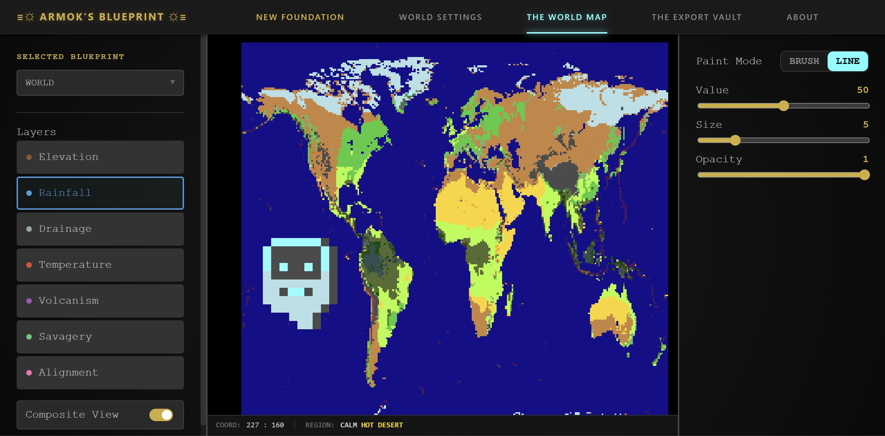
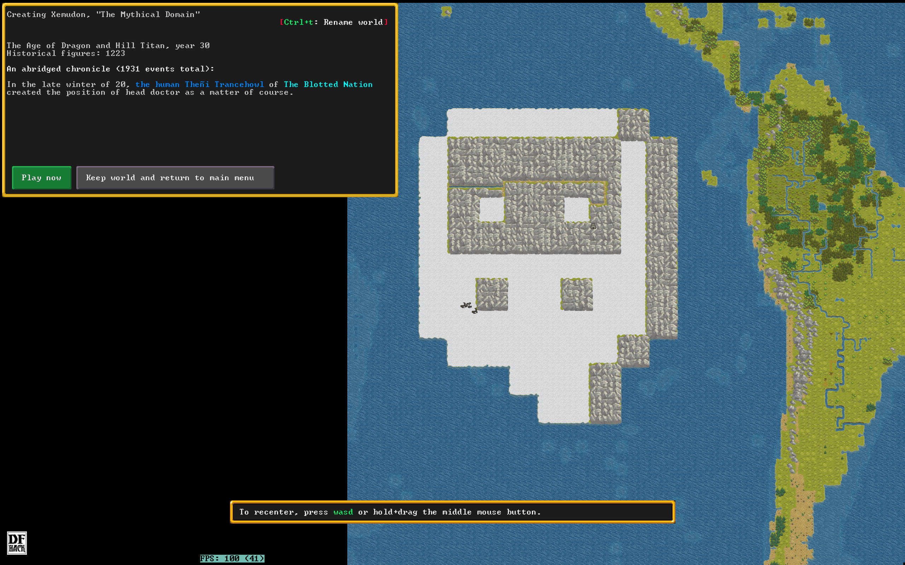
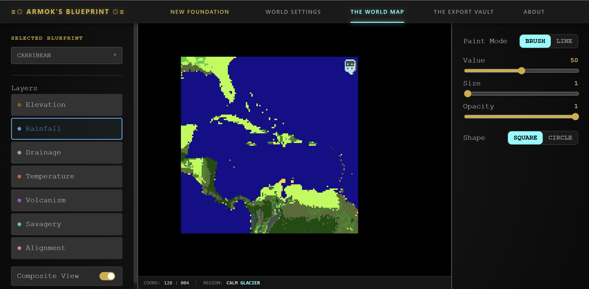
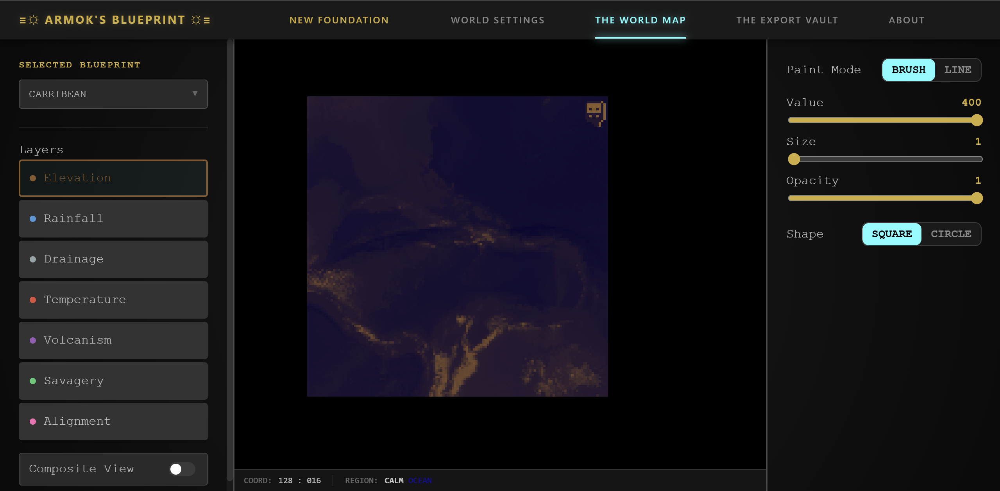
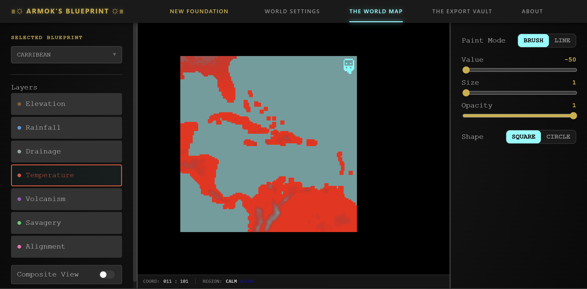

# ⚒️ Armok's Blueprint: The Great Scriptorium

> *"It is a masterwork blueprint. It is menacing with spikes of code. It relates to the founding of a world."*

**Armok's Blueprint** is a web-utility designed for the manual engraving of world-generation parameters for Dwarf Fortress. While the gods provide random chance, the Blueprint provides **intent**.




[](https://opensource.org/licenses/MIT)
[](https://github.com/Pythongor/armoks-blueprint)

---

## 📜 What is this Artifact?

In the early ages, Overseers were forced to rely on the whims of the World Engine, hitting "Generate" and praying for a favorable embark. **Armok's Blueprint** changes the law of the land. 

It is a **pixel-perfect map editor** that allows you to hand-paint Elevation, Rainfall, Savagery, and Volcanism directly onto a digital slab. It translates your art into the "Secret Language" of `world_gen.txt` tokens, allowing you to force the game to build exactly what you envisioned.

<table><tr><td></td><td></td></tr></table>

---

## 🏔️ Why Strike This Earth? (Comparison)

Why use the Armok's Blueprint instead of the old-world tools?

| Feature | In-Game Advanced Gen | PerfectWorld | **Armok's Blueprint** |
| :--- | :--- | :--- | :--- |
| **Control** | Random / Seeded | Algorithmic Sliders | **Manual Pixel Painting** |
| **Feedback** | Wait for Generation | Trial & Error | **Instant Visual Preview** |
| **Precision** | Low (Global) | Medium (Regional) | **High (Tile-by-Tile)** |

---

## 🛠️ The Loom & The Anvil (Stack & Architecture)

The runes beneath the surface are organized for performance and reliability:

* **The Skeleton (React & TypeScript):** Strictly typed logic to ensure no "Fractures" in the masonry.
* **The Heart (Redux Toolkit):** Centralized state management for presets, coordinate tracking, and world parameters.
* **The Canvas (Phaser 3 / HTML5 Canvas):** A high-performance rendering engine capable of handling up to 257x257 grids with real-time composite biome calculation.
* **The Transmuter (Custom Parser):** A bi-directional logic engine that converts raw `world_gen.txt` strings into memory-efficient `Int16Array` buffers and back again.


<table><tr><td></td><td></td><td></td></tr></table>

---

## 📥 Installation & Setting the Forge

To set up the Scriptorium in your own mountain hall:

1.  **Clone the Source Scrolls:**
    ```bash
    git clone https://github.com/Pythongor/armoks-blueprint.git
    ```
2.  **Ignite the Spark (Install dependencies):**
    ```bash
    npm install
    ```
3.  **Strike the Earth (Run development server):**
    ```bash
    npm run dev

---

## 🤝 The Fellowship of Architects (Contribution)

No masterwork is ever truly finished. If you are a scribe of the code-mines or a veteran Overseer, your help is welcomed:

* **Report a Fracture:** Open an **Issue** if you find a bug in the coordinate mapping or a crash in the parser.
* **Refine the Runes:** **Pull Requests** are welcome for new brush types, better biome resolvers, UI enhancements or anything else you can think of.
* **The Scribe’s Mark:** If you find this tool useful, leave a ⭐ on the repository to let the other dwarves know where the fine crafts are kept.

---

## ⚖️ License

Distributed under the **MIT License**. See the `LICENSE` file for more information.